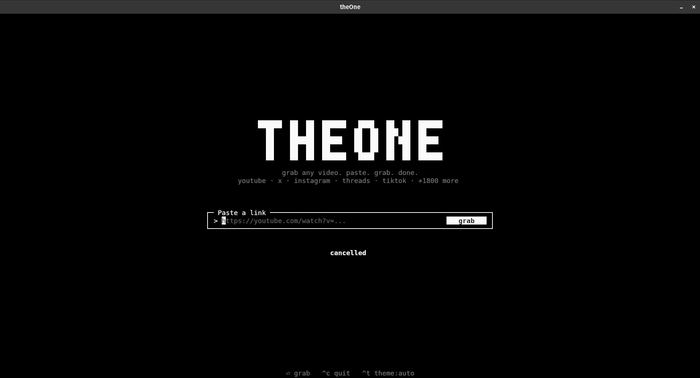
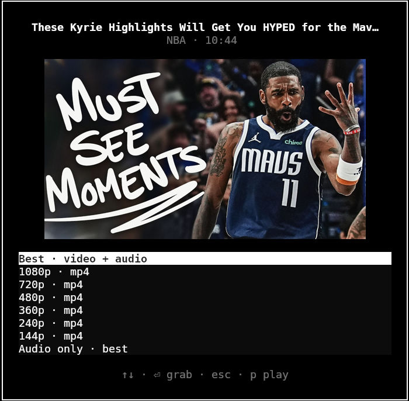
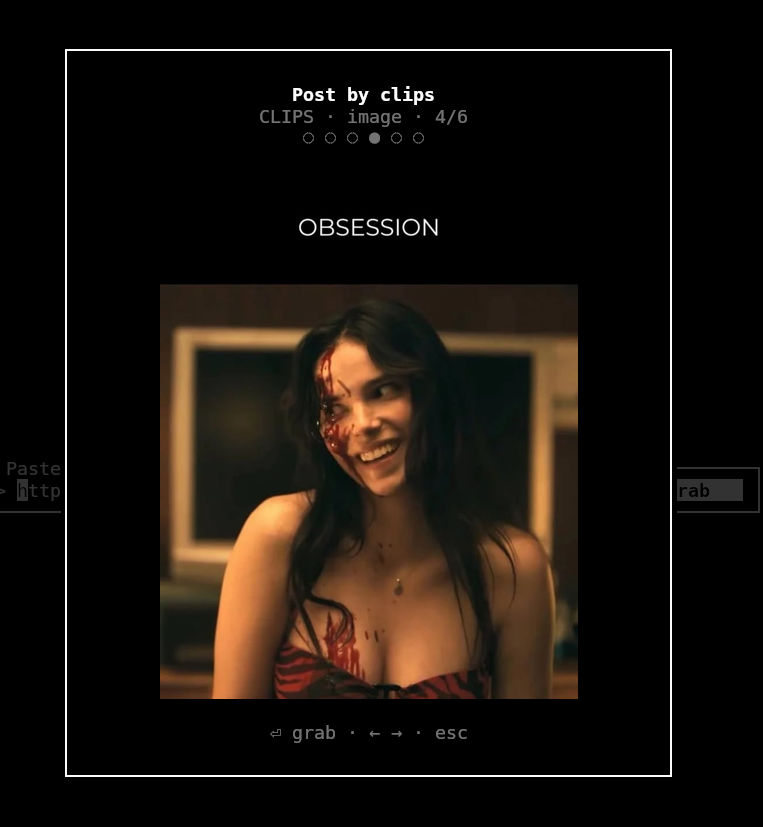

<div align="center">


**Personal yt-dlp TUI: paste a link, grab, done.**

Works with YouTube, Instagram, TikTok, X, Threads, and 1800+ sites via [yt-dlp](https://github.com/yt-dlp/yt-dlp).

</div>

---

## Features

### Paste → grab

Minimal home screen: drop a URL, hit Enter (or click **grab**). First run asks once for a download folder; after that it just works.

<p align="center">
  
</p>

### Quality picker with in-TUI thumbnails

YouTube (and similar) opens a format list with a sharp preview in the terminal: best, height caps, or audio-only. No external image viewer required (Kitty TGP / Sixel / half-cell).

<p align="center">
  
</p>

### Carousel browse & grab

Multi-image posts (Instagram and friends): preview the current slide, flip with `←` `→`, grab only that slide. Full-frame images preferred over square crops when the site offers both.

<p align="center">
  
</p>

### Also included

- **Platform folders:** downloads land under `youtube/`, `instagram/`, `tiktok/`, `x/`, … inside your chosen directory
- **Live progress:** percent, speed, and title while yt-dlp runs; `Esc` cancels
- **Stream preview:** optional `mpv` play without saving (`p`)
- **Themes:** auto / dark / light (`Ctrl+T`)
- **Preferences:** audio bias (`Ctrl+A`), quality cap (`Ctrl+Q`), URL history (`↑` `↓`)
- **Hardening knobs:** concurrent fragments, optional aria2c, `cookies_from_browser` for age gates / 403s

## Install

**Needs:** Python 3.12+, a **recent** [`yt-dlp`](https://github.com/yt-dlp/yt-dlp) on `PATH` (2025+, distro packages are often too old), and [`ffmpeg`](https://ffmpeg.org/).

```bash
# yt-dlp (keep it fresh)
uv tool install --force yt-dlp
yt-dlp --version

# theOne
git clone https://github.com/mibienpanjoe/theOne.git
cd theOne
uv tool install --editable .
```

Ensure `~/.local/bin` is on your `PATH`, then:

```bash
theOne
```

Optional: [`deno`](https://deno.land/) or Node (YouTube JS challenges), `wl-paste`/`xclip` (clipboard), `aria2c` (faster downloads), [`mpv`](https://mpv.io/) (stream preview).

### Dev without a global install

```bash
uv sync --group dev
uv run theOne
```

## Keys

| Key | Action |
|-----|--------|
| `Enter` | YouTube: format picker · IG/TikTok/X: preview confirm → grab |
| `←` `→` | Carousel: previous / next slide |
| `p` | Stream preview via mpv (no save) |
| `Ctrl+V` | Paste URL from clipboard |
| `Ctrl+A` | Prefer audio in the format picker |
| `Ctrl+Q` | Prefer quality: best → 1080 → 720 |
| `Ctrl+T` | Cycle theme: auto → dark → light |
| `Esc` | Cancel picker or in-flight download |
| `↑` / `↓` | URL history / move in format list |
| `Ctrl+C` | Quit |

## Config

`~/.config/theOne/config.toml` · history in `~/.config/theOne/history.json`

```toml
download_dir = "/home/you/Videos/theOne"
theme = "auto"                 # auto | dark | light
quality = "best"               # best | 1080 | 720
audio_only = false
concurrent_fragments = 8
use_aria2c = false
cookies_from_browser = "firefox"   # optional: helps with 403 / age gates
```

### HTTP 403 Forbidden

Typical fixes:

1. Install a JS runtime (`deno` or `node`) for YouTube signature decryption  
2. Set `cookies_from_browser` in config  
3. Update yt-dlp: `uv tool install --force yt-dlp`  
4. Retry a lower quality  

## Docs & tests

Product requirements: [`docs/01_requirements_prd.md`](docs/01_requirements_prd.md) · SRS: [`docs/02_requirements_srs.md`](docs/02_requirements_srs.md)

```bash
uv sync --group dev
uv run pytest
```

## License

[MIT](LICENSE) · see [CONTRIBUTING.md](CONTRIBUTING.md) if you want to help.
